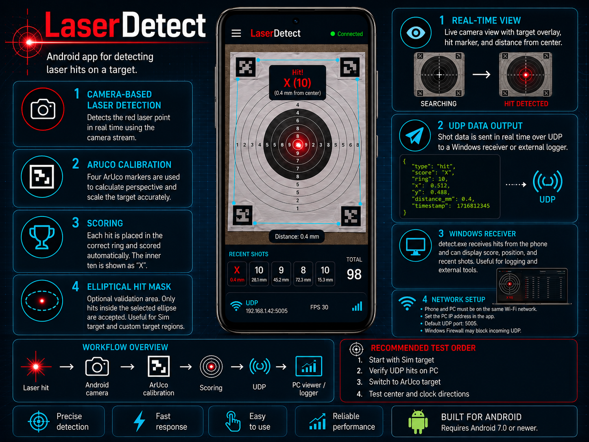

# LaserDetect Test Release

LaserDetect is an experimental Android app for detecting and scoring laser hits on a target using the phone camera, using a "Dry Lasers Trainer Cartridge" for your specific firearm.

This repository contains prebuilt test releases only.

  

## Downloads

Download the latest test release from the **Releases** section on the right side of this GitHub page.

The release assets include:

- `LaserDetect.apk` — Android app                 
- `detect.exe` — Windows UDP receiver/viewer      
- `dfs_15m.pdf` — printable target                

## How to install the APK on an Android phone

This is the easiest method for testers.

### Installing the Android APK

1. Open the GitHub repository.
2. Go to **Releases**.
3. Open the latest release.
4. Tap `LaserDetect.apk`.
5. Wait for the APK to download.
6. Open the downloaded APK file.
7. Android may ask you to allow installation from unknown sources.
8. Allow installation for the browser or file manager.
9. Install the app.
10. Start LaserDetect.
11. When Android asks for camera permission, choose **Allow**.
    (LaserDetect needs camera access to detect laser hits and read the ArUco target markers.)
12. After testing, uninstall the app if you no longer want it on your phone.
    
## Usage

Before using LaserDetect with firearms, training weapons, or laser cartridges, always verify that the firearm is unloaded and that no live ammunition is present in the firearm, magazine, chamber, shooting area, or test setup.

LaserDetect is intended primarily for indoor use under dim or controlled lighting conditions. Strong ambient light, direct sunlight, reflections, glare, bright red objects, or unstable lighting may reduce detection accuracy or cause false detections.

See [SETTINGS.md](SETTINGS.md) for details.

### Quick Start

1. Install the APK on an Android phone.
2. Start `detect.exe` on a Windows PC. This receives the shot data over Wi-Fi. Make sure the PC and phone are connected to the same network. LaserTarget/LaserDetect must send UDP data to the PC IP address. Use port `5005`, or the same port as configured in your receiver script/app. If hits are not received, check that Windows Firewall is not blocking UDP traffic.
3. In the LaserDetect app, open UDP settings and enter the PC IP address. Use port `5005`.
4. Start with simulated target mode (`Sim target`) and verify that hits are received by `detect.exe`.
5. A dedicated `LaserHitMask` can be used for elliptical hit validation.
6. Switch to ArUco target detection (`ArUco target`) when the simulated target test works.
7. Place the phone in a stable position with a clear view of the ArUco target. The phone may be placed at an angle, but a distance of about 20–30 cm is recommended for testing.
8. Test hits at the center, 12 o’clock, 3 o’clock, 6 o’clock, and 9 o’clock.
9. Verify that the score, hit position, and UDP output match the actual hit location.
10. To save battery, turn on `Power Save`.
11. Have fun.

###  Python oneliner to recieve and log data

py -c "import socket;s=socket.socket(2,2);s.bind(('',5005));print('UDP 5005');[print(d.decode('utf-8','replace')) for d,a in iter(lambda:s.recvfrom(4096),None)]"

## License

LaserDetect is distributed as a prebuilt binary test release only.  
The source code is not published.

Personal, educational, and non-commercial testing is permitted.  
Commercial use, redistribution, modification, reverse engineering, or integration into commercial products or services is not permitted without prior written permission.

See [LICENSE.md](LICENSE.md) for details.
